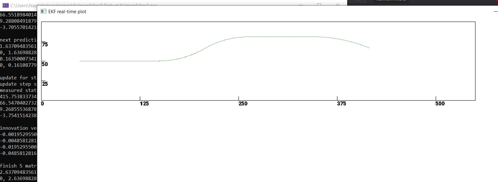
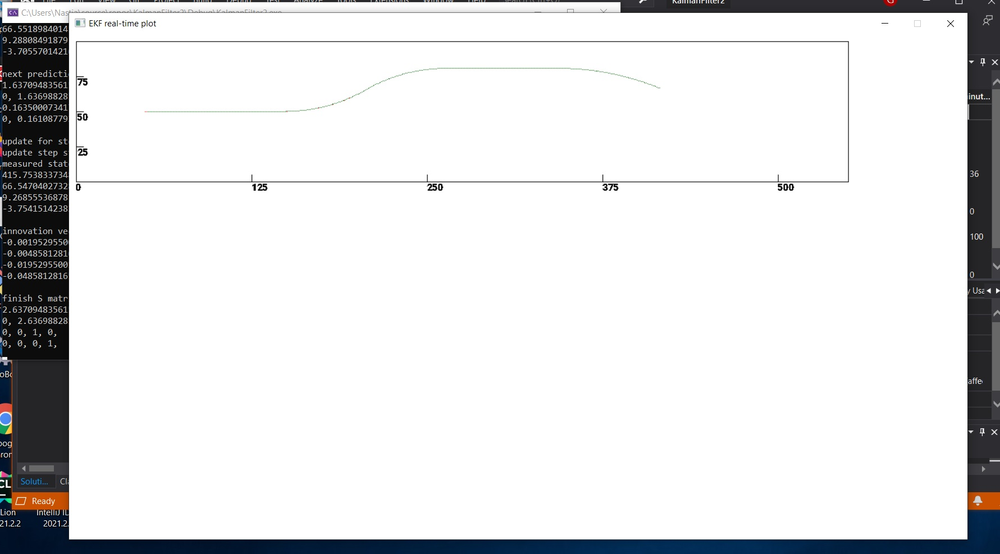

# Extended Kalman Filter
Extended Kalman Filter implementation

That was a test task for one well known company. Inedited.

Raw version from this summer

## Description

This my little simple implementation of kalman filter, extended. For data used only data for position.

Data was copypasted from matlab to two separated arrays only because that was more easy for copypast this way)))

## Given model and other starter info

See [pdf](Tracking%20assignment.pdf) instruction

The trajectory includes the x and y positions of the
object, for each time step from 1 to 500, in increments of Ts = 0.1 s.

## Assigment

* Write the prediction and measurement update steps (equations) of the
problem in an extended Kalman filter (EKF) setting, including all necessary matrices.
* Generate 100 random measurement sequences from the entire trajectory.
A sonar measurement includes range and angle to the object plus additive
Gaussian noise with the above-stated standard deviations.
* Implement an EKF for the problem, with tuneable process noise parameter
  * Hint: Let the initial state vector be the true x and y positions and set the initial velocities to 0.
* For three choices of q, run a Monte-Carlo evaluation with at least 100
samples of the EKF and plot the root mean squared error in x and y
position as well as x and y velocity.
* What can be observed from the previous exercise? How does the process
noise affect the performance?

## Solution and some decision made

For first statment I used first and second mesurment. It was dictated by EKF requirement that first statment need to be 
near the real one for good working of this specific filter algoritm.

I used very base SDL and its only have dots that apear every second (?) in screan.

